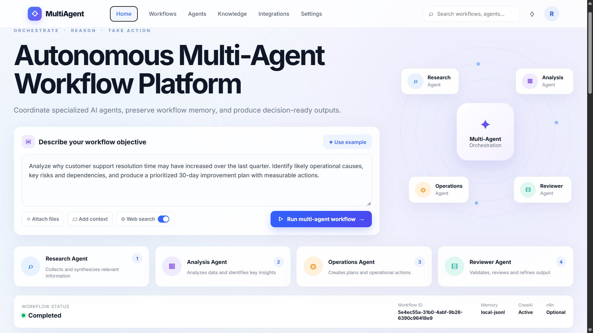
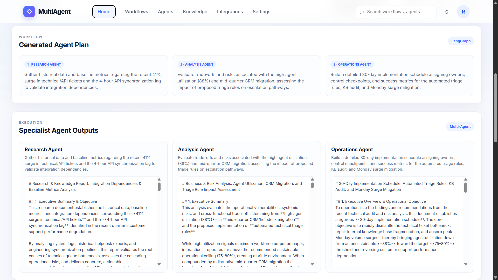
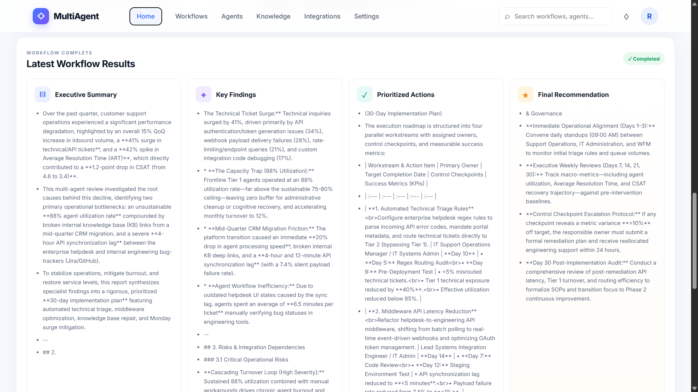

# Autonomous Multi-Agent Workflow Platform

An AI-powered multi-agent workflow platform that breaks down a complex objective into specialized stages, coordinates multiple agents, preserves workflow memory, and produces a final decision-ready output.

This project demonstrates how **LangGraph-style orchestration**, **specialist AI agents**, **workflow memory**, and **modern backend integration** can be combined into one practical system.

---

## Overview

The platform is designed to simulate a real multi-agent execution flow.

A user gives one workflow objective, and the system processes it through multiple specialized agents:

- **Research Agent** – gathers and organizes relevant information
- **Analysis Agent** – evaluates findings and identifies key insights
- **Operations Agent** – creates action plans and recommendations
- **Reviewer Agent** – reviews, refines, and prepares the final output

The result is a structured, decision-ready response rather than just a raw LLM answer.

---

## Screenshots

## 1. Home Dashboard



The home screen allows the user to enter a workflow objective, trigger the multi-agent workflow, and view the overall orchestration layout.

---

## 2. Specialist Agent Outputs



This screen shows how the workflow is decomposed into multiple agent stages, with each specialist agent generating its own structured output.

---

## 3. Final Workflow Results



The final results page displays the consolidated output, including the executive summary, key findings, prioritized actions, and final recommendation.

---

## How It Works

The system follows a multi-step orchestration flow:

```text
User Objective
   ↓
LangGraph Planner
   ↓
Research Agent
   ↓
Analysis Agent
   ↓
Operations Agent
   ↓
Reviewer Agent
   ↓
Final Decision-Ready Report